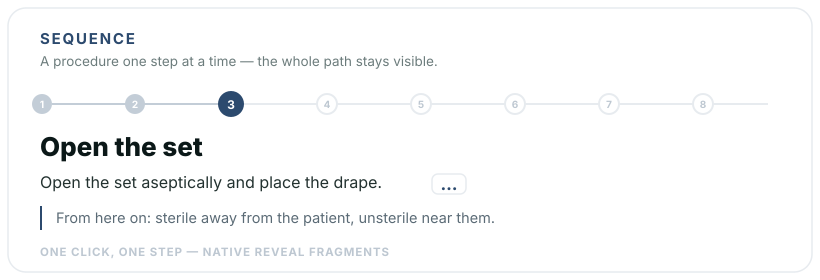
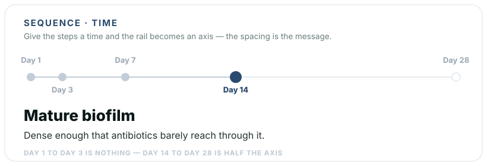

# Reveal - Sequence

[](https://revealjs.com) [](LICENSE)

Walk a procedure **one step at a time** in [reveal.js](https://revealjs.com) — or lay a course of events on a **real time axis**, where the distance between two points means something. Both come from the same markup.

[](https://florianloyns.github.io/reveal.js-sequence/demo.html)

[](https://florianloyns.github.io/reveal.js-sequence/demo.html)

**[Live demo](https://florianloyns.github.io/reveal.js-sequence/demo.html)**

## Why

A procedure written as a bullet list shows every step at once and gives them all the same weight. That is exactly wrong for teaching one: the learner needs to see the whole path — so they understand that step 5 only works because step 2 was done right — while looking at one step at a time.

Splitting the procedure across several slides loses the path. Revealing bullets one by one keeps the list. Sequence keeps both: a thin rail carries the whole procedure, and the stage below holds only the step you are on.

The second mode exists because some lists are not procedures but courses of events, and there the *spacing* is the information. Day 1 to day 3 is nothing; day 14 to day 28 is half the axis. No bullet list can say that.

## Installation

**Requires** reveal.js 4.2 or newer. Tested with reveal.js 5.x.

Copy the `sequence` folder into your reveal.js `plugin/` folder — or install from npm.

```console
npm install reveal.js-sequence
```

## Setup

```html
<script src="dist/reveal.js"></script>
<script src="plugin/sequence/sequence.js"></script>
<script>
  Reveal.initialize({ plugins: [ RevealSequence ] });
</script>
```

**As a module**

```html
<script type="module">
  import Reveal from './dist/reveal.esm.js';
  import RevealSequence from './plugin/sequence/sequence.esm.js';
  Reveal.initialize({ plugins: [ RevealSequence ] });
</script>
```

## Usage

Write the steps. That is all.

```html
<div class="sequence">
  <div class="step">
    <div class="t">Prepare</div>
    <div class="d">Disinfect the surface and lay out the material.</div>
    <div class="w">Whatever is missing now will be missing later, with sterile gloves on.</div>
  </div>
  <div class="step">
    <div class="t">Open the set</div>
    <div class="d">Open the set aseptically and place the drape.</div>
    <div class="w">From here on: sterile away from the patient, unsterile near them.</div>
  </div>
</div>
```

Step 1 is on screen when the slide opens; every further step is a **native reveal fragment**. So the arrow keys, the remote, the speaker view, the URL fragment index and printing all behave exactly as they do everywhere else in your deck — the plugin adds no navigation of its own.

The rail is tappable: jump straight back to step 2 when a question sends you there.

| Part | Written as | Required |
|---|---|---|
| Title | `.t`, or `h3`/`h4`/`h5`, or `data-title` | no |
| Text | `.d`, or simply everything else in the step | no |
| Reasoning | `.w` or `.why` | no |
| Time | `data-t="7"` on the step, caption via `data-cap` | only for the time axis |

## The reasoning

The **why** of a step is the part worth teaching, and the part you rarely want on screen before you have asked the room about it. By default it hides behind a discreet `…` at the end of the step; one tap and it appears. Set `data-why="open"` on the sequence to have it printed from the start — right for a slide that will be handed out.

```html
<div class="sequence" data-why="open"> … </div>
```

## Time axis

Give every step a `data-t` and the rail becomes an axis with proportional spacing.

```html
<div class="sequence">
  <div class="step" data-t="1"  data-cap="Day 1"><div class="t">Insertion</div><div class="d">…</div></div>
  <div class="step" data-t="14" data-cap="Day 14"><div class="t">Mature biofilm</div><div class="d">…</div></div>
  <div class="step" data-t="28" data-cap="Day 28"><div class="t">Fully colonised</div><div class="d">…</div></div>
</div>
```

Mixed sequences — some steps with a time, some without — fall back to the rail, because a half-scaled axis would lie.

## Feeding an ordering question

Give the sequence an `id` and point an [ordering quiz](https://github.com/florianloyns/reveal.js-quiz) at it:

```html
<div class="sequence" id="catheter"> … </div>
…
<div class="quiz" data-type="order" data-seq="#catheter">
  <div class="quiz-q">Put the steps in the right order.</div>
</div>
```

The options are filled from the sequence and shuffled by the quiz plugin. Write the procedure once, teach it and examine it — and when you change a step, the question changes with it. Register `RevealSequence` **before** `RevealQuiz` so the markup is in place in time.

## Configuration

```js
Reveal.initialize({
  sequence: {
    why: 'dots',        // 'dots' | 'open' | 'none'
    accent: '#2C4A6E',
    muted:  '#C3CDD7',
    line:   '#E7EBEF'
  },
  plugins: [ RevealSequence ]
});
```

`data-why` on a sequence beats the global setting.

## Printing

In print (`?print-pdf`) the whole sequence is listed: every step with a numbered badge, its title, its text and its reasoning. From five steps on the list runs in two columns so long procedures are not squeezed; a time axis shows each step's time mark instead of the number.

### Shared print tokens

In print, sizes and colours are read from CSS custom properties. Set them once in your theme and every plugin of the family (quiz, sequence, glossary, quizgrid, hotspot) prints in the same type scale; without a theme each plugin falls back to its own defaults. Explicit plugin options (such as `printFontSize`) still win.

```css
:root{
  --print-pad: 38px 54px 34px;   /* margin of generated pages */
  --print-kicker: 21px;          /* small caps line above the title */
  --print-kicker-track: .28em;
  --print-rule: 2px solid #E7EBEF;
  --print-title: 38px;
  --print-title-after: 20px;
  --print-lead: 22px;            /* question text */
  --print-body: 19px;            /* body text, options, entries */
  --print-meta: 16px;            /* secondary line – the minimum */
  --print-label: 14px;           /* numbers, buttons, column heads */
  --print-lh: 1.4;
  --print-gap: 14px;
  --print-ink: #0B1818; --print-text: #22312F; --print-muted: #5A6A75;
  --print-accent: #2C4A6E;       /* numbers, kicker */
  --print-ok: #639922;           /* reserved for the solution */
  --print-line: #D9E0E7;
}
```

## Notes

Deliberately quiet: no box, no coloured fill, no shadow. In a deck that uses colour to carry meaning — amber for danger, green for a normal value — a step's reasoning must not be coloured, or the colour stops meaning anything. Where a single step really is dangerous, put your own warning box in that step's text and the colour says something again.

When printing and in the overview the whole sequence is laid out in full: a handout with one visible step would be worthless. Respects `prefers-reduced-motion`. Without JavaScript the steps are plain readable blocks, so nothing is lost.

## Changelog

**1.1.1** — Print detection unified across the plugin family: every print rule now applies both in the browser print dialog and in reveal’s `?print-pdf` view, so the on-screen preview looks like the PDF; the print view is recognised the same way everywhere (`?print-pdf` or `view: 'print'`).

**1.1.0** — Print layout harmonised with the plugin family (shared print tokens, numbered badges, two columns from five steps, time marks on a time axis). Step numbers such as "3." or "Step 3 ·" are stripped from the cards of a fed ordering question, so they no longer give the answer away.

**1.0.0** — initial release.

## Imprint

Responsible: Florian Loyns — [imprint & privacy notice](https://florianloyns.com/Impressum/) (German)

## License

MIT — see [LICENSE](LICENSE). Built for [reveal.js](https://revealjs.com) by Hakim El Hattab.
